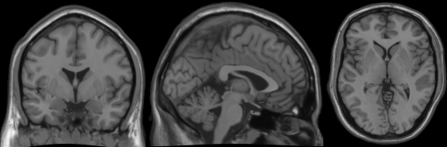
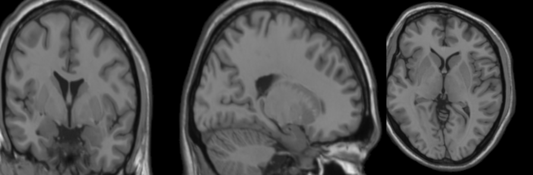

# mriaug
`pip install mriaug` to use a **3D image library** that is **[~50x faster and simpler](https://github.com/codingfisch/mriaug?tab=readme-ov-file#speed-)** than [`torchio`](https://github.com/fepegar/torchio) by

- **only** using **PyTorch** → full GPU(+autograd) support 🔥
- being tiny: **~200 lines of code** → no room for bugs 🐛
    
while offering **~20 different augmentations** (incl. MRI-specific operations) 🩻

👶 Normal users should use `mriaug` via [`niftiai`](https://github.com/codingfisch/niftiai), a deep learning framework for 3D images, since it
- provides `aug_transforms3d`: A convenient function that compiles all `mriaug`mentations!
- simplifies all the code needed for data loading, training, visualization...check it out [here](https://github.com/codingfisch/niftiai)!

👴 Experienced users can build their own framework upon `mriaug` (use [`niftiai/augment.py`](https://github.com/codingfisch/niftiai/blob/main/niftiai/augment.py) as a cheat sheet)

## Usage 💡
Let's create a 3D image tensor (with additional batch and channel dimension) and apply `flip3d`
```python
import torch
from mriaug import flip3d

shape = (1, 1, 4, 4, 4)
x = torch.linspace(0, 1, 4**3).view(*shape)
x_flipped = flip3d(x)
print(x[..., 0, 0])  # tensor([[[0.0000, 0.2540, 0.5079, 0.7619]]])
print(x_flipped[..., 0, 0])  # tensor([[[0.7619, 0.5079, 0.2540, 0.0000]]])
```
Explore the [gallery](https://github.com/codingfisch/mriaug?tab=readme-ov-file#gallery-) to understand the usage and effect of all ~20 augmentations!

## Speed 💨
The popular libraries `torchio` and [`MONAI`](https://github.com/Project-MONAI/MONAI) (utilizes `torchio`) use [`ITK`](https://github.com/SimpleITK/SimpleITK) and can do this

*PyTorch tensor → NumPy array → NiBabel image → ITK operation (C/C++) → NumPy array → PyTorch tensor*

to augment a PyTorch tensor 🤦

Instead, `mriaug` directly uses PyTorch—runs C/C++ on CPU and CUDA on GPU—resulting in
- **~50x fewer lines of code**: `torchio`: ~10,000 LOC, `mriaug`: ~200 LOC 🤓
- **~50x speedup** on GPU 🔥 based on the table below (run [`speed.py`](https://github.com/codingfisch/mriaug/blob/main/runall.py) to reproduce) 💨

*Runtimes on AMD Ryzen 9 5950X CPU and NVIDIA GeForce RTX 3090 GPU*

### Runtime in seconds

| Transformation | `torchio` | `mriaug` on CPU | `mriaug` on GPU | Speedup vs. `torchio` |
|----------------|-----------|-----------------|-----------------|-----------------------|
| Flip           | 0.014     | 0.011           | 0.002           | **7.5x**              |
| Affine         | 0.296     | 0.601           | 0.011           | **27.8x**             |
| Warp           | 0.942     | 0.825           | 0.076           | **12.3x**             |
| Bias Field     | 3.339     | 0.196           | 0.043           | **77.4x**             |
| Noise          | 0.115     | 0.104           | 0.001           | **219.7x**            |
| Downsample     | 0.303     | 0.011           | 0.001           | **591.0x**            |
| Ghosting       | 0.231     | 0.173           | 0.003           | **73.3x**             |
| Spike          | 0.291     | 0.173           | 0.003           | **96.9x**             |
| Motion         | 0.682     | 0.531           | 0.009           | **76.9x**             |

## Gallery 🧠

Let's load an example 3D image `x`, show it with [`niftiview`](https://github.com/codingfisch/niftiview) (used to create all images below)


define some arguments

```python
size = (160, 196, 160)
zoom = torch.tensor([[-.2, 0, 0]])
rotate = torch.tensor([[0, .1, 0]])
translate = torch.tensor([[0, 0, .2]])
shear = torch.tensor([[0, .05, 0]])
```

and **run all augmentations** (see [`runall.py`](https://github.com/codingfisch/mriaug/blob/main/runall.py)):

### [`flip3d(x, dim=0)`](https://github.com/codingfisch/mriaug_beta/blob/main/mriaug/core.py#L7)


### [`dihedral3d(x, k=2)`](https://github.com/codingfisch/mriaug_beta/blob/main/mriaug/core.py#L11)


### [`crop3d(x, translate, size)`](https://github.com/codingfisch/mriaug_beta/blob/main/mriaug/core.py#L20)


### [`zoom3d(x, zoom)`](https://github.com/codingfisch/mriaug_beta/blob/main/mriaug/core.py#L27)


### [`rotate3d(x, rotate)`](https://github.com/codingfisch/mriaug_beta/blob/main/mriaug/core.py#L33)


### [`translate3d(x, translate)`](https://github.com/codingfisch/mriaug_beta/blob/main/mriaug/core.py#L39)


### [`shear3d(x, shear)`](https://github.com/codingfisch/mriaug_beta/blob/main/mriaug/core.py#L45)


### [`affine3d(x, zoom, rotate, translate, shear)`](https://github.com/codingfisch/mriaug_beta/blob/main/mriaug/core.py#L51)


### [`warp3d(x, magnitude=.1)`](https://github.com/codingfisch/mriaug_beta/blob/main/mriaug/core.py#L58)


### [`affinewarp3d(x, zoom, rotate, translate, shear, magnitude=.1)`](https://github.com/codingfisch/mriaug_beta/blob/main/mriaug/core.py#L67)


### [`bias_field3d(x, intensity=2.)`](https://github.com/codingfisch/mriaug_beta/blob/main/mriaug/core.py#L79)


### [`contrast(x, lighting=.5)`](https://github.com/codingfisch/mriaug_beta/blob/main/mriaug/core.py#L84)


### [`noise3d(x, intensity=.05)`](https://github.com/codingfisch/mriaug_beta/blob/main/mriaug/core.py#L88)


### [`chi_noise3d(x, intensity=.05, dof=3)`](https://github.com/codingfisch/mriaug_beta/blob/main/mriaug/core.py#L92) set dof=2 for Rician noise


### [`downsample3d(x, scale=.25, dim=2)`](https://github.com/codingfisch/mriaug_beta/blob/main/mriaug/core.py#L97)


### [`ghosting3d(x, intensity=.5)`](https://github.com/codingfisch/mriaug_beta/blob/main/mriaug/core.py#L107)


### [`spike3d(x, intensity=.2)`](https://github.com/codingfisch/mriaug_beta/blob/main/mriaug/core.py#L116)


### [`ringing3d(x, intensity=.5)`](https://github.com/codingfisch/mriaug_beta/blob/main/mriaug/core.py#L126)


### [`motion3d(x, intensity=.5)`](https://github.com/codingfisch/mriaug_beta/blob/main/mriaug/core.py#L137)

