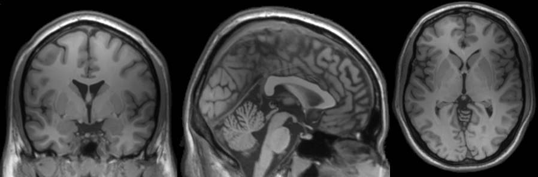
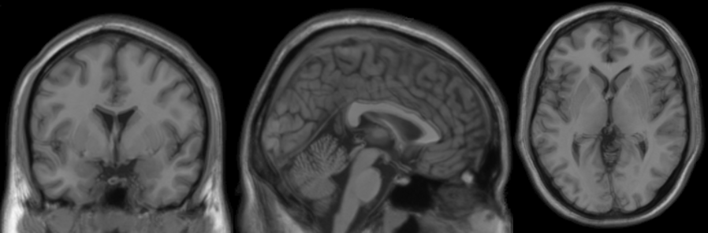

# mriaug
`pip install mriaug` to use a **3D image library** that is [**faster**]() than [`torchio`](https://github.com/fepegar/torchio) and [`MONAI`](https://github.com/Project-MONAI/MONAI) by

- **only** using **PyTorch** → full GPU(+autograd) support 🔥
- being tiny: **<300 lines of code** → no room for bugs 🐛
    
while offering **~20 different augmentations** (incl. MRI-specific operations) 🩻

⚠️ Normal users 👶 should use `mriaug` via [`niftiai`](https://github.com/codingfisch/niftiai), a deep learning framework for 3D images, since it
- provides the function `aug_transforms3d`: A convenient way to compile all `mriaug`mentations!
- simplifies all the code needed for data loading, training, visualization...check it out [here](https://github.com/codingfisch/niftiai)!

⚠️ Experienced users 👴 that only want to use `mriaug` can read [`niftiai/augment.py`](https://github.com/codingfisch/niftiai/blob/main/niftiai/augment.py) as a cheat sheet

## Usage 💡
Let's create a 3D image tensor (with additional batch and channel dimension) and apply `flip3d`
```python
import torch
from mriaug import flip3d

shape = (1, 1, 4, 4, 4)
x = torch.linspace(0, 1, 4**3).view(*shape)
x_flipped = flip3d(x)
print(x[..., 0, 0])  # tensor([[[0.0000, 0.2540, 0.5079, 0.7619]]])
print(x_flipped[..., 0, 0])  # tensor([[[0.7619, 0.5079, 0.2540, 0.0000]]])
```
Explore the following gallery to understand the usage and effect of all ~20 augmentations!

## Gallery 🧠

Let's load an example 3D image `x`, show it with [`niftiview`](https://github.com/codingfisch/niftiview) (used to create all images below)


define some arguments

```python
size = (160, 196, 160)
translate = torch.tensor([[0, 0, .2]])
rotate = torch.tensor([[0, .1, 0]])
zoom = torch.tensor([[-.2, 0, 0]])
shear = torch.tensor([[0, .05, 0]])
```

and **run all augmentations** (see [`runall.py`](https://github.com/codingfisch/mriaug/blob/main/runall.py)):

### [`flip3d(x)`](https://github.com/codingfisch/mriaug_beta/blob/main/mriaug/core.py#L7)


### [`dihedral3d(x, k=2)`](https://github.com/codingfisch/mriaug_beta/blob/main/mriaug/core.py#L12)


### [`crop3d(x, translate, size)`](https://github.com/codingfisch/mriaug_beta/blob/main/mriaug/core.py#L21)


### [`translate3d(x, translate)`](https://github.com/codingfisch/mriaug_beta/blob/main/mriaug/core.py#L35)


### [`rotate3d(x, rotate)`](https://github.com/codingfisch/mriaug_beta/blob/main/mriaug/core.py#L41)


### [`zoom3d(x, zoom)`](https://github.com/codingfisch/mriaug_beta/blob/main/mriaug/core.py#L47)


### [`shear3d(x, shear)`](https://github.com/codingfisch/mriaug_beta/blob/main/mriaug/core.py#L53)


### [`affine3d(x, translate, rotate, zoom, shear)`](https://github.com/codingfisch/mriaug_beta/blob/main/mriaug/core.py#L59)


### [`warp3d(x, magnitude=.01)`](https://github.com/codingfisch/mriaug_beta/blob/main/mriaug/core.py#L66)


### [`affinewarp3d(x, translate, rotate, zoom, shear, magnitude=.01)`](https://github.com/codingfisch/mriaug_beta/blob/main/mriaug/core.py#L73)


### [`contrast(x, lighting=.5)`](https://github.com/codingfisch/mriaug_beta/blob/main/mriaug/core.py#L88)


### [`noise3d(x, intensity=.05)`](https://github.com/codingfisch/mriaug_beta/blob/main/mriaug/core.py#L92)


### [`chi_noise3d(x, intensity=.05, dof=3)`](https://github.com/codingfisch/mriaug_beta/blob/main/mriaug/core.py#L96) set dof=2 for Rician noise


### [`downsample3d(x, scale=.25, dim=2)`](https://github.com/codingfisch/mriaug_beta/blob/main/mriaug/core.py#L101)


### [`bias_field3d(x, intensity=.1)`](https://github.com/codingfisch/mriaug_beta/blob/main/mriaug/core.py#L111)


### [`ghosting3d(x, intensity=.5)`](https://github.com/codingfisch/mriaug_beta/blob/main/mriaug/core.py#L117)


### [`spike3d(x, intensity=.2)`](https://github.com/codingfisch/mriaug_beta/blob/main/mriaug/core.py#L126)


### [`ringing3d(x, intensity=.5)`](https://github.com/codingfisch/mriaug_beta/blob/main/mriaug/core.py#L138)


### [`motion3d(x, intensity=.5)`](https://github.com/codingfisch/mriaug_beta/blob/main/mriaug/core.py#L149)


## Speed

| Transformation | Image size | torchio | mriaug (CPU) | mriaug (GPU) |
|----------------|------------|---------|--------------|--------------|
| Flip           | 256³       | 0.020   | 0.011        | 0.007        |
| Affine         | 256³       | 0.291   | 0.604        | 0.030        |
| Warp           | 256³       | 0.895   | 3.992        | 0.129        |
| Noise          | 256³       | 0.112   | 0.103        | 0.001        |
| Motion         | 256³       | 0.657   | 0.520        | 0.045        |
| Bias Field     | 256³       | 3.145   | 4.175        | 0.156        |
| Ghosting       | 256³       | 0.228   | 0.162        | 0.003        |
| Spike          | 256³       | 0.261   | 0.161        | 0.003        |
| Downsample     | 256³       | 0.277   | 0.012        | 0.001        |
